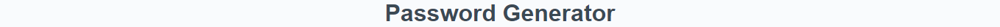
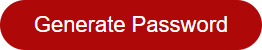
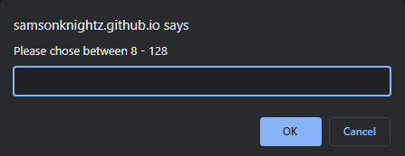
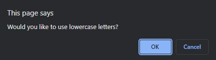
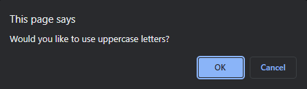
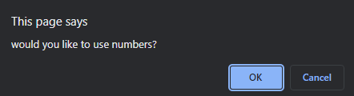
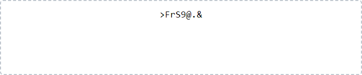

# Password-Generator

Link to this project https://samsonknightz.github.io/Password-Generator/

Check out my other [projects](https://github.com/SamsonKnightz) on github.

## Description

+ Password Generator starts with a click of "Password Generator" button.
 
+ When you click the button you will given prompts for your password criteria. This will include a set length between 8 and 128 characters.

+ After setting length, you will be prompted to confirm whether or not to include, lowercase, uppercase, numbers, and/ or special characters.

 + After all prompts are answered a password is then generated that matches users selected criteria.

## Table Of Contents
+ [How to use](#)

+ [Full Website](#)

## How to use
+ Click on the "Generate Password" button to start the password generatation process.

    

+ You will be prompted to select between 8 - 128 characters.

+ Then you will be prompted to use lowercase characters.

+ Then you will be prompted to use uppercase characters.

+ Then you will be prompted to use numeric characters.

+ Then you will be prompted to use special characters.

+ You will then be presented with a generated password.

## Full Website
